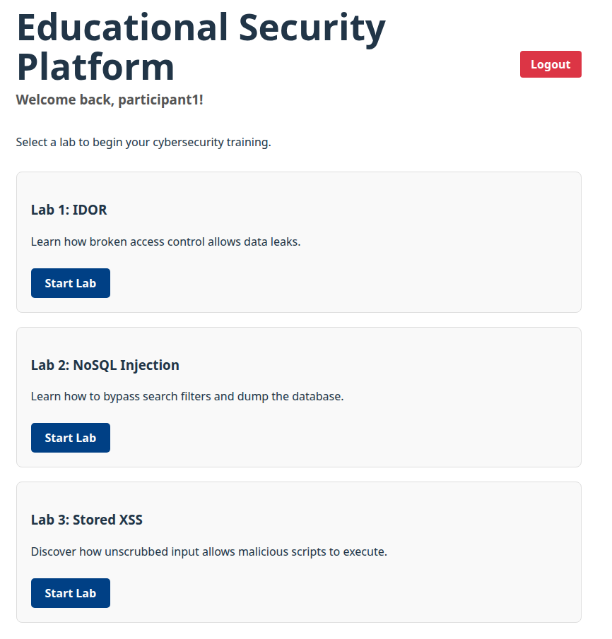
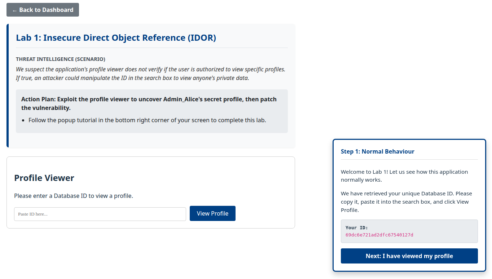
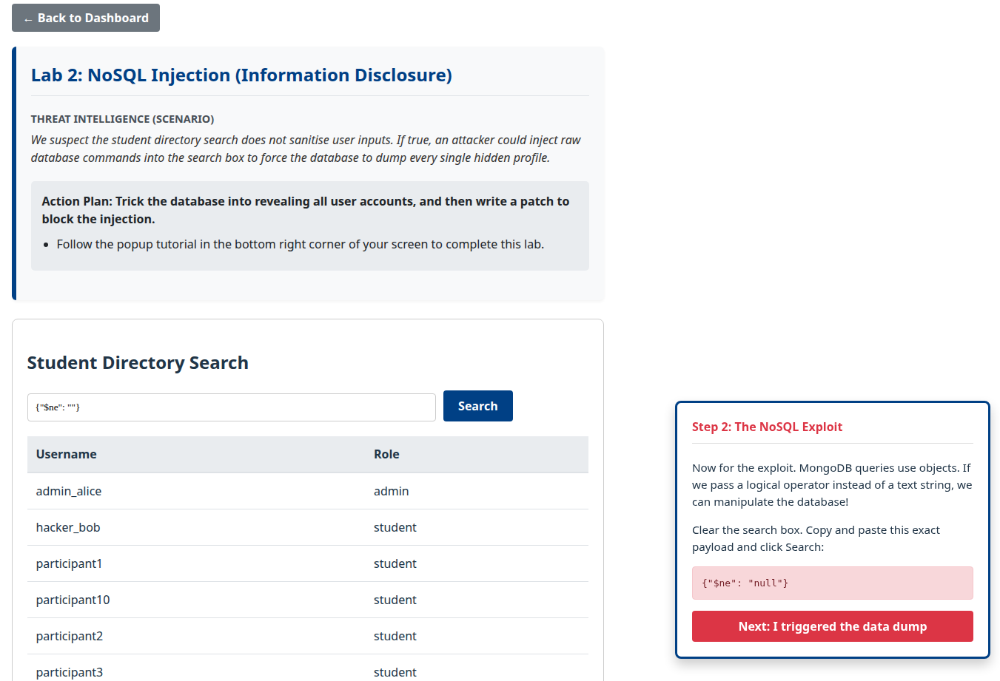
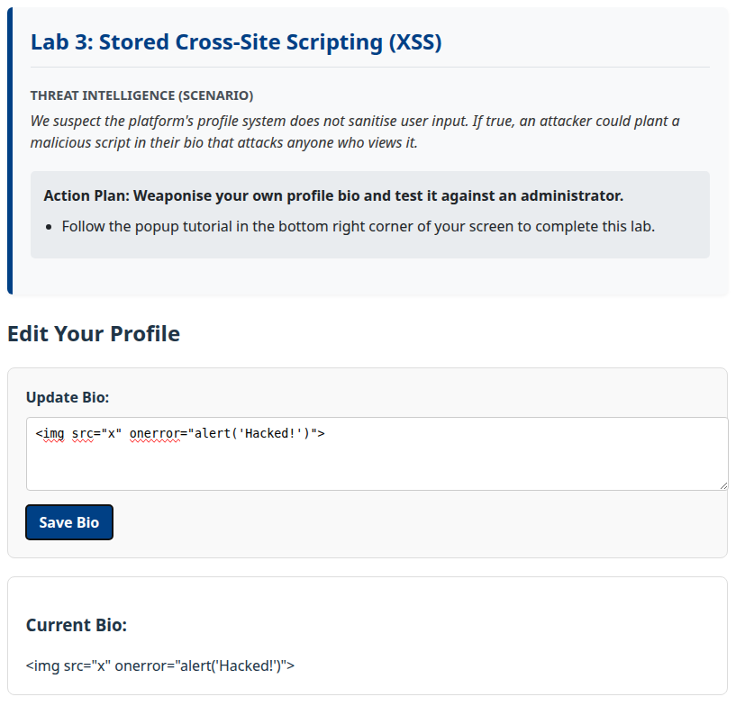

# Interactive Web Security Platform (OWASP Vulnerabilities)

This repository contains an interactive educational platform built as a research prototype for a Master of Computer Science dissertation. The platform demonstrates core OWASP Top 10 web vulnerabilities and their corresponding mitigations in a modern web environment. 

In an experimental evaluation with novice developers, participants achieved a statistically significant improvement in practical security knowledge after using these interactive modules.

> ⚠️ **SECURITY WARNING:** This application contains intentionally vulnerable backend logic and frontend components designed strictly for educational research and penetration testing practice. Do not deploy this code in a production environment.

---

## Platform Overview

The platform provides a guided dashboard where learners can choose between isolated security modules, run simulated attacks, and test secure coding patches.


*Platform dashboard listing available interactive security labs.*

---

## The Interactive Security Labs

The platform features three core security labs guiding users through both the exploitation (Red Team) and mitigation (Blue Team) phases.

### 1. Insecure Direct Object Reference (IDOR)

* **The Vulnerability:** Broken access control in the profile viewer permits attackers to change the account identifier and view sensitive data belonging to other accounts.
* **The Mitigation:** Strict session ownership verification and Role-Based Access Control (RBAC) ensure users can only view their own records.


*Lab 1: Testing access control logic in the profile viewer interface.*

---

### 2. NoSQL Injection

* **The Vulnerability:** The student directory search endpoint accepts unvalidated query parameters. Injecting logical MongoDB query operators (such as `{"$ne": ""}`) bypasses filters and leaks database records.
* **The Mitigation:** Strict type validation on the server rejects any incoming search parameter that is not a plain text string.


*Lab 2: Injecting query operators to bypass filters and dump database records.*

---

### 3. Stored Cross-Site Scripting (XSS)

* **The Vulnerability:** Unsanitised user input saved directly to the database executes inside the browser when rendered through unsafe DOM properties such as `dangerouslySetInnerHTML`.
* **The Mitigation:** Dynamic user data binds directly to standard React JSX elements, allowing the framework to auto-escape malicious characters before execution.


*Lab 3: Injecting an unsanitised payload into the profile editor.*

---

## System Architecture

The platform runs on the MERN stack to reflect modern single-page application design:

* **Database:** MongoDB Atlas (NoSQL)
* **Backend:** Node.js, Express
* **Frontend:** React, Vite
* **Authentication:** JSON Web Tokens (JWT), Bcrypt password hashing

---

## Local Installation Guide

Follow these steps to run the application on your local machine.

### Prerequisites

* Node.js (v18 or newer)
* A MongoDB Atlas cluster connection string

### 1. Clone the Repository

```bash
git clone [https://github.com/farisfitrijuraidi/my-security-project.git](https://github.com/farisfitrijuraidi/my-security-project.git)
cd my-security-project
```

### 2. Set Up the Backend

```bash
cd server
npm install
```

Create a file named `.env` in the server directory and add your private connection details:

```bash
MONGO_URI=your_mongodb_connection_string_here
jwtSecret=your_highly_secure_random_string
```

Start the backend server:

```bash
node index.js
```

The server should display a message confirming it is running on port 5000 and connected to MongoDB.

### 3. Set Up the Frontend

Open a new terminal window, navigate to the client folder, and install the dependencies.

```bash
cd client
npm install
```

Start the React development server:

```bash
npm run dev
```

The application will now be accessible in your web browser at `http://localhost:5173`.
